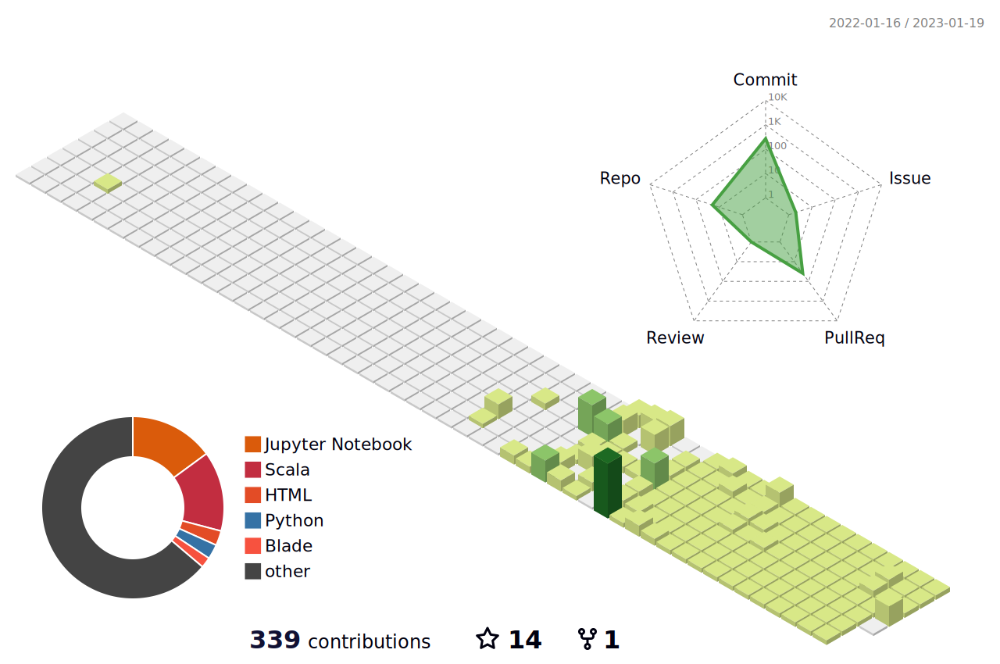

 

  

  

---

 <!--  <h1 align="center">Hi, Maira Usman Here🤍  </h1>
 -->

 
 <a href="https://www.linkedin.com/in/maira-usman-/" target="_blank">

  

</a>
 <h4> Visitor count   </h4>
<!--  <h4 align="center">I am a Tech Geek👨🏼‍💻</h4>

   -->
 

 

 ### 👩‍💻About Me:
  

 - 👷 Currently pursuing BSc in Software Engineering(2021-2025) from Usman Institute of Technology.
 - This is my first repository on GitHub.
 - I love painting:🎨🖌️, coffee:ˏˋ☕ˎˊ .
 - 🌱 Tech Geek, always ready to learn new Technologies/Frameworks/Languages.
 - :telescope: I’m working as a Software Engineer and contributing to frontend and backend for building web applications.
 
                                                        
 
  # :⚡ Skills and Languages:

 

        

 
 # :📈 GitHub Stats:
| stats | streaks | languages |
|---|---|---|
|  |  |  |
<!--    -->

---

  # :🌐 Connect with me:

 
 

 
---
  

  

---

# 🏆 GitHub Trophies

---

---

# Github Contributions

# Github Metrics

---
